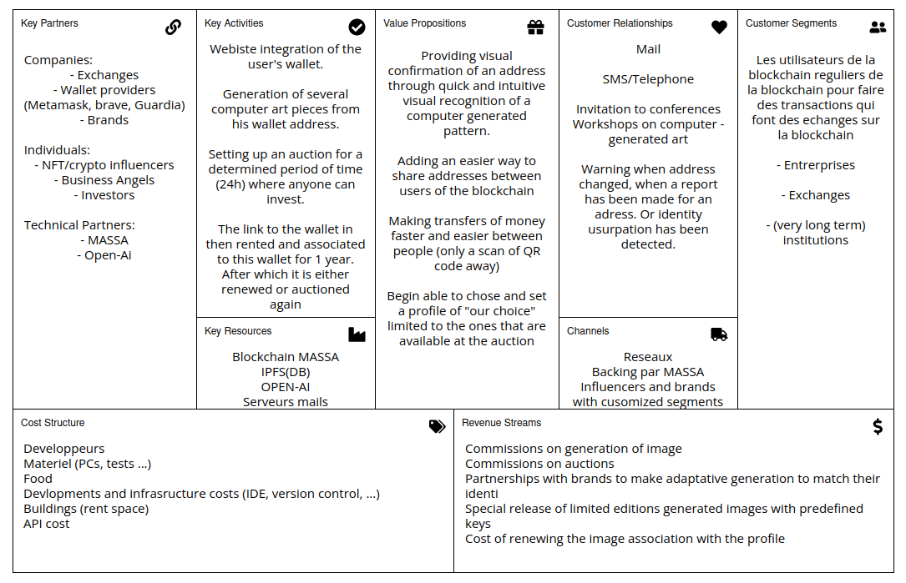

# IDFY

## Introduction

En apprenant que dans le monde de la cryptomonaie et de la blockchain, le seul moyen de se partager un wallet était d'envoyer une très longue chaine de charactères au destinataire, nous avons voulu faciliter ce processus. Sachant aussi qu'un site qui affichait une addresse wallet sur laquelle certaines personnes étaient censé envoyé de l'argent c'était fait hacker et que personne ne s'était rendu compte que l'addresse du wallet avait changé avant un certain temps, nous avont eut l'idée de créer IDFY.

IDFY est un site permettant de créer des QRcodes sécurisés afin de partager de manière simple et efficace l'addresse de son wallet.

Notre QR code se présenterait de manière simple avec une image autogénérée au centre, qui permettrait à l'utilisateur de comparer l'image qu'on lui a envoyé avec celle présente sur le site lorsqu'on lui envoie l'addresse.

## Comment ?

### Utilisateurs quotidiens

Nous proposons a chaque utilisateur de la blockchainm d'aller sur notre site, et d'y rentrer leur addresse de Wallet, ainsi que de payer les "frais de génération".Ensuite, nous produisons un hash a partir de cette addresse. Afin d'eviter que deux addresses proches génèrent la même image.
Une fois ce hash récupéré, nous utilisons un mnemonic pour générer une suite de mots aléatoire (mais basés sur l'addresse).\
Une fois cette suite de mots générée. Nous l'utilisons pour générer une image avec la technologie d'OpenAi. Cette image est ensuite mise aux enchères 24h. Pendant ces 24h, n'importe qui, qui serait intéressé par l'image est en mesure d'enchérir.
Au bout de ces 24h, l'image est associée pour une durée d'un an avec l'adresse de la personne qui a remporté l'enchère. Et cette personne peut utiliser le QR code généré pour s'identifier ou transmettre son addresse.\
Au bout d'un an, l'utilisateur a la possibilité dans un premier temps de renouveler son image afin qu'elle reste associée a son addresse. Dans le cas échéant, l'image sera alors remise aux enchères pour 24h et le cycle recommence.

### Entreprises

Pour les entreprises, le principe reste relativement similaire, a l'exception près que nous leur proposons d'altérer la génération de l'image dans un premier temps,afin d'avoir quelque chose qui colle avec leur identité de marque. En échange de frais de génération plus élevés. Ensuite, nous leur proposons de passer outre la première enchère. Ce qui leur permet de conserver l'image tant qu'ils décident de la renouveler. Dans le cas ou une entreprise déciderait de ne pas renouveler son image, elle passerait alors aux enchères publiques pendant 24h comme n'importe laquelle des autres.

## Business Canva

